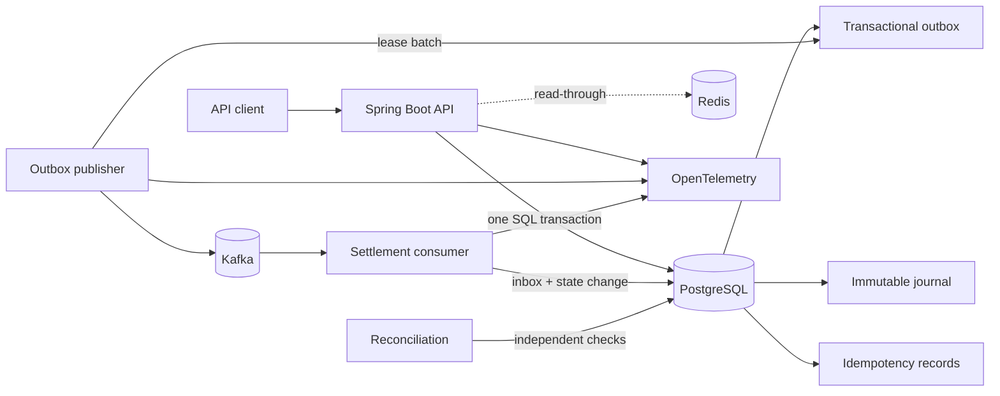

# EventLedger

[](https://github.com/newpoluton-alt/EventLedger/actions/workflows/ci.yml)
[](https://github.com/newpoluton-alt/EventLedger/actions/workflows/codeql.yml)
[](https://kotlinlang.org/)
[](https://openjdk.org/)

EventLedger is a production-minded payment and reconciliation system built to
demonstrate the failure modes that matter in backend engineering: duplicate
requests, concurrent debits, process crashes, redelivery, and temporary
PostgreSQL or Kafka outages.

The project does not claim distributed "exactly once." PostgreSQL owns the
accounting truth; delivery is deliberately at least once, and every boundary is
made idempotent.

## What it demonstrates

- Double-entry accounting with immutable journal rows and a deferred PostgreSQL
  constraint that rejects unbalanced entries at commit.
- Idempotent payment creation with canonical request hashes, stable replayed
  responses, and conflict detection when a key is reused with another payload.
- Ordered account locks that prevent overspending and deadlocks under concurrent
  transfers.
- A transactional outbox with leased `FOR UPDATE SKIP LOCKED` claims, bounded
  retries, exponential backoff, and terminal dead-event state.
- Kafka consumers with a durable inbox, record-level acknowledgement, retries,
  and per-topic dead-letter queues.
- Reconciliation of journal balance, payment cardinality, balance projections,
  stale payments, outbox delivery, negative balances, and dead-letter incidents.
- Redis read caching that fails open; cache availability never affects ledger
  correctness.
- OpenTelemetry traces, Prometheus metrics and alerts, a Grafana dashboard, and
  Tempo trace storage.
- Testcontainers integration tests, Pact contracts, Python resilience tests, and
  k6 load tests.
- A multi-stage non-root container and an AWS reference deployment in Terraform
  using ECS, RDS PostgreSQL, MSK, ElastiCache, KMS, Secrets Manager, and
  CloudWatch.

## Architecture



The critical write path is short:

```text
idempotency record
  + payment
  + journal entry
  + debit and credit postings
  + balance projection updates
  + outbox event
= one PostgreSQL commit
```

See [the architecture notes](docs/architecture.md) for invariants, transaction
boundaries, and the recovery model.

## Failure guarantees

| Failure | Durable outcome | Recovery |
| --- | --- | --- |
| Duplicate HTTP request | One payment and one accounting effect | Same key and body replay the original response |
| Same key, different body | No second payment | API returns `409 IDEMPOTENCY_KEY_REUSED` |
| Crash before database commit | No partial payment, journal, or outbox rows | Retry the same request |
| Crash after commit, before HTTP response | Payment remains posted once | Retry returns the stored resource |
| Kafka unavailable | Payment still commits; event remains pending | Publisher retries with backoff |
| Crash after Kafka send, before outbox acknowledgement | Event may be delivered again | Consumer inbox makes the business effect a no-op |
| Consumer process/DB failure | Kafka record is not acknowledged | Retry, then route permanent failures to `.DLT` |
| Corrected dead-letter event | Incident and payment are locked together | Authorized replay settles once and marks the incident `REPLAYED` |
| Balance projection drift | Journal remains the source of truth | Reconciliation raises an auditable discrepancy |

## Run locally

Requirements: Docker Desktop with Compose v2. The container build supplies
Java and Gradle.

```bash
make up
docker compose ps
```

Compose uses `local-development-key` for the protected API. Override it with
`EVENTLEDGER_API_KEY` before `make up` when sharing a development environment.

The stack includes the API, PostgreSQL, Kafka in KRaft mode, Redis,
OpenTelemetry Collector, Prometheus, Tempo, and Grafana. The local profile also
loads three demo accounts:

| Account | UUID | Opening balance |
| --- | --- | ---: |
| Customer | `00000000-0000-0000-0000-000000000001` | EUR 10,000.00 |
| Merchant | `00000000-0000-0000-0000-000000000002` | EUR 0.00 |
| Clearing | `00000000-0000-0000-0000-000000000000` | EUR -10,000.00 |

Demo data lives in a separate Flyway location and is not enabled by the
production Terraform configuration.

Create a payment:

```bash
curl --fail-with-body \
  --request POST http://localhost:8080/api/v1/payments \
  --header 'Content-Type: application/json' \
  --header 'X-API-Key: local-development-key' \
  --header 'Idempotency-Key: demo-payment-0001' \
  --data '{
    "sourceAccountId": "00000000-0000-0000-0000-000000000001",
    "destinationAccountId": "00000000-0000-0000-0000-000000000002",
    "amount": "42.50",
    "currency": "EUR",
    "reference": "order-2026-0001"
  }'
```

Repeat that command unchanged. It returns the same payment with
`X-Idempotent-Replay: true`. Change the amount but keep the key to see the
conflict protection.

Inspect balances and trigger reconciliation:

```bash
curl --fail-with-body \
  --header 'X-API-Key: local-development-key' \
  http://localhost:8080/api/v1/accounts/00000000-0000-0000-0000-000000000001/balance

curl --fail-with-body \
  --header 'X-API-Key: local-development-key' \
  --request POST http://localhost:8080/api/v1/reconciliation/runs
```

Local endpoints:

- API and Actuator: `http://localhost:8080`
- Prometheus: `http://localhost:9090`
- Grafana: `http://localhost:3000` (`admin` / `eventledger`)
- Tempo API: `http://localhost:3200`

Stop without losing local data with `make down`. `make clean` also removes
named volumes and is intentionally destructive to the local demo state.

## API

| Method | Endpoint | Purpose |
| --- | --- | --- |
| `POST` | `/api/v1/accounts` | Create a zero-balance customer or merchant account |
| `GET` | `/api/v1/accounts/{id}` | Read cacheable account metadata |
| `GET` | `/api/v1/accounts/{id}/balance` | Read the current posted balance directly from PostgreSQL |
| `POST` | `/api/v1/payments` | Atomically post a payment; requires `Idempotency-Key` |
| `GET` | `/api/v1/payments/{id}` | Read payment state |
| `POST` | `/api/v1/dead-letters/{id}/replay` | Validate and transactionally replay one open settlement incident |
| `POST` | `/api/v1/reconciliation/runs` | Run all consistency checks |
| `GET` | `/api/v1/reconciliation/runs/{id}` | Read a reconciliation result |
| `GET` | `/api/v1/reconciliation/runs/latest` | Read the most recent run |
| `GET` | `/actuator/health/readiness` | Kubernetes/ECS readiness |
| `GET` | `/actuator/prometheus` | Prometheus metrics |

Errors use RFC 9457 problem details with stable machine-readable codes.

The API key is intentionally a single-tenant internal-service credential for
this portfolio system, not end-user authorization. A multi-tenant deployment
must replace it with client identities, account-level authorization, and
separate operator permissions before exposing the API beyond a trusted
integration boundary.

## Verification

With JDK 21 and Docker running:

```bash
./gradlew check
./scripts/validate-test-assets.sh
```

The Gradle suite includes fast unit tests and PostgreSQL integration tests.
The black-box resilience suite is explicitly opt-in because its fault scenarios
stop and restart local services:

```bash
./scripts/bootstrap-python-tests.sh
EVENTLEDGER_RUN_INTEGRATION=1 ./scripts/run-python-tests.sh
```

Enable destructive local fault injection only after reviewing
[the test guide](tests/README.md):

```bash
EVENTLEDGER_RUN_INTEGRATION=1 \
EVENTLEDGER_RUN_FAULT_TESTS=1 \
./scripts/run-python-tests.sh
```

The k6 scenario repeats idempotency keys under load and asserts stable resource
IDs and replay behavior. The Pact file in `contracts/` documents the consumer
contract.

## Operations and AWS

- [AWS Terraform reference stack](infra/README.md)
- [Broker failure runbook](docs/runbooks/broker-failure.md)
- [Database failure runbook](docs/runbooks/database-failure.md)
- [Service crash recovery](docs/runbooks/service-recovery.md)
- [Reconciliation runbook](docs/runbooks/reconciliation.md)

Terraform is a reference implementation and creates billable AWS resources.
Review variables, remote state, network egress, retention, and organizational
security requirements before applying it.

## Repository map

```text
src/main/kotlin/       application, ledger, outbox, Kafka, reconciliation
src/main/resources/    Flyway schema and configuration
src/test/              JUnit and Testcontainers integration tests
tests/                 Python black-box and failure-injection tests
load-tests/            k6 idempotency load scenario
contracts/             Pact V3 consumer contract
observability/         Prometheus, Grafana, Tempo, OTel Collector
infra/terraform/       AWS production reference architecture
docs/runbooks/         recovery procedures
```

## Design stance

EventLedger favors explicit, inspectable mechanisms over distributed-systems
marketing:

- The immutable journal is authoritative; the mutable balance table is a
  projection that reconciliation can verify.
- Kafka availability is not part of the payment database transaction.
- Delivery duplicates are normal and safe.
- Redis is an optimization, never a lock or financial source of truth.
- Accounting corrections are new reversal or adjustment entries, never edits to
  history.

This is the story behind the implementation—and the part worth discussing in a
backend engineering interview.
