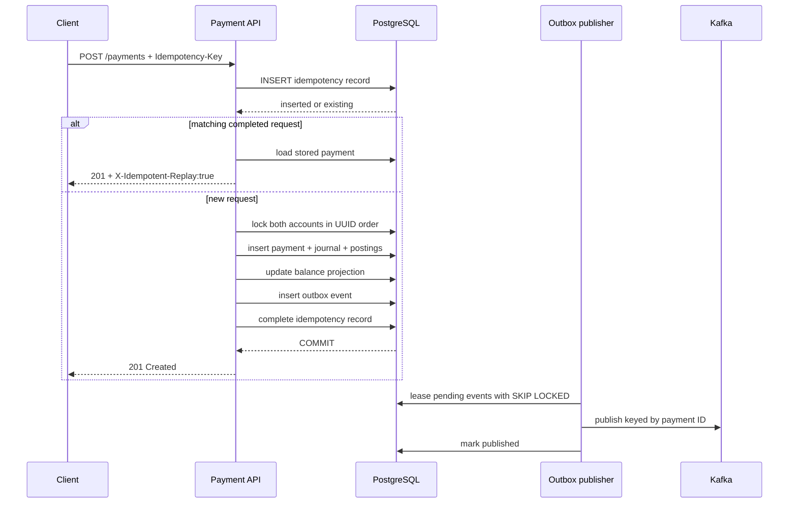

# EventLedger architecture

## Goals

EventLedger is a modular monolith that keeps accounting correctness inside one
PostgreSQL transaction while integrating with Kafka through explicit
at-least-once delivery. This shape is intentionally deployable by a small team:
module boundaries are visible in code, but there is no distributed transaction
between prematurely separated services.

## Accounting model

Money is stored as signed 64-bit minor units and a three-letter currency.
Amounts in postings are always positive; `DEBIT` and `CREDIT` express the side.
For the wallet-style accounts in this project, the posted balance is:

```text
sum(credits) - sum(debits)
```

Every journal entry is subject to a deferred PostgreSQL constraint trigger. At
transaction commit it must contain at least two postings and total debits must
equal total credits. Updates and deletes on journal entries or postings are
rejected by a second database trigger. Corrections therefore require a new
reversal or adjustment.

`account_balances` is a lockable, fast projection. It is updated in the same
transaction as the journal, but it is not the source of truth. Reconciliation
re-derives every balance from postings and reports drift.

## Payment transaction



The idempotency row and result share the payment transaction. A concurrent
insert for the same key waits on the unique constraint. Once the first
transaction commits, the second request reads the completed resource. If the
canonical request hash differs, it receives a conflict instead.

Both balance rows are locked in stable UUID order. That prevents deadlocks and
ensures concurrent outgoing payments observe the latest source balance before
the insufficient-funds check.

## Outbox delivery

Publisher instances run bounded sweeps and claim each event individually using
`FOR UPDATE SKIP LOCKED`. Every claim gets a fresh owner and expiry lease, then
commits before calling Kafka. Successful publishes are acknowledged in
PostgreSQL. Failures return to `PENDING` with bounded exponential backoff;
exhausted events move to `DEAD` for operator attention.

Publishing outside the claim transaction avoids holding database locks while a
broker is slow. It also creates one unavoidable ambiguity:

1. Kafka accepts the record.
2. The process crashes before `published_at` is written.
3. The expired lease is reclaimed and the event is sent again.

That is expected at-least-once behavior.

## Consumer idempotency and dead letters

The settlement consumer uses record acknowledgement. Its database transaction
first inserts `(consumer_name, event_id)` into `consumer_inbox`. A duplicate
event conflicts on that primary key and returns successfully without repeating
the state transition.

Transient failures are retried by the Kafka listener error handler. After the
bounded retry budget, the original record and failure headers are published to
`<topic>.DLT`. Malformed or semantically impossible events are classified as
non-retryable and go directly to the dead-letter path.

If the process crashes after the database commit but before Kafka records the
offset, redelivery reaches the inbox and becomes a no-op.

Settlement envelopes must declare `settlement.confirmed.v1`, version `1`, and
an `aggregateId` equal to `payload.paymentId`. Event and settlement timestamps
cannot exceed the allowed clock skew, and settlement cannot predate payment
creation. A payment has at most one final settlement; a second event ID with
identical business content is a no-op, while contradictory content is routed to
operator attention.

Recording a DLT incident moves a known posted payment to `NEEDS_ATTENTION`.
After correcting the root cause, an operator can replay exactly one incident
through `POST /api/v1/dead-letters/{incidentId}/replay`. One database
transaction locks the incident and payment, revalidates the stored envelope,
applies the settlement through the normal inbox/outbox path, and marks the
incident `REPLAYED`. Invalid or conflicting payloads remain open.

## Reconciliation

Only one application replica performs reconciliation at a time, enforced by a
PostgreSQL transaction-scoped advisory lock. Each run stores its result and
individual discrepancies.

Checks cover:

1. journal entries balance and contain enough postings;
2. every payment has the exact source debit and destination credit for its
   amount and currency;
3. every account has a balance projection;
4. balance projections equal journal-derived balances;
5. every posted payment has one `payment.posted.v1` outbox event;
6. settlement state, settlement fact, timestamp, and
   `payment.settled.v1` outbox event agree;
7. outbox events are not stale or terminally dead;
8. posted payments are not stuck beyond the settlement threshold;
9. non-system balances are non-negative;
10. no unresolved dead-letter incident remains.

Reconciliation never edits journal history. An operational repair can rebuild a
projection from postings; a financial correction must post a new audited entry.

## Availability boundaries

| Component | Required to post a payment? | Behavior while unavailable |
| --- | --- | --- |
| PostgreSQL | Yes | API returns retryable `503`; same idempotency key remains safe |
| Kafka | No | Outbox accumulates and retries |
| Redis | No | Cache errors fail open to PostgreSQL |
| OpenTelemetry backend | No | Export failure does not change business state |

## Production topology

The Terraform reference uses private subnets across availability zones:

- an ALB terminates inbound HTTPS and routes to ECS/Fargate;
- RDS PostgreSQL is Multi-AZ, encrypted, backed up, and protected from public
  access;
- MSK provides replicated Kafka topics with a production override of replication
  factor 3 and minimum in-sync replicas 2;
- ElastiCache supplies TLS-enabled Redis;
- KMS and Secrets Manager protect credentials and data keys;
- CloudWatch alarms cover service health and managed infrastructure;
- OpenTelemetry exports application telemetry without entering the correctness
  path.

This repository deliberately leaves organization-specific items—DNS zones,
certificate issuance, remote Terraform state, budgets, and deployment
promotion—to the adopting environment.
